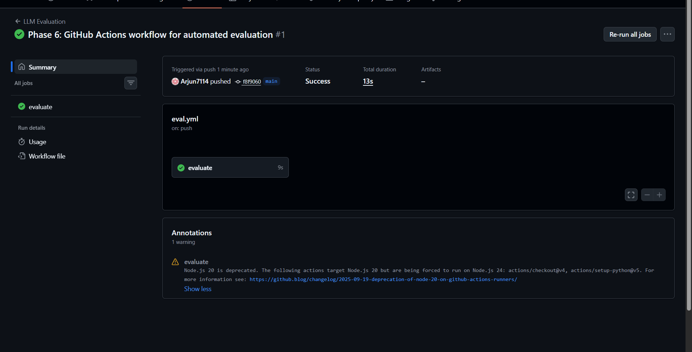
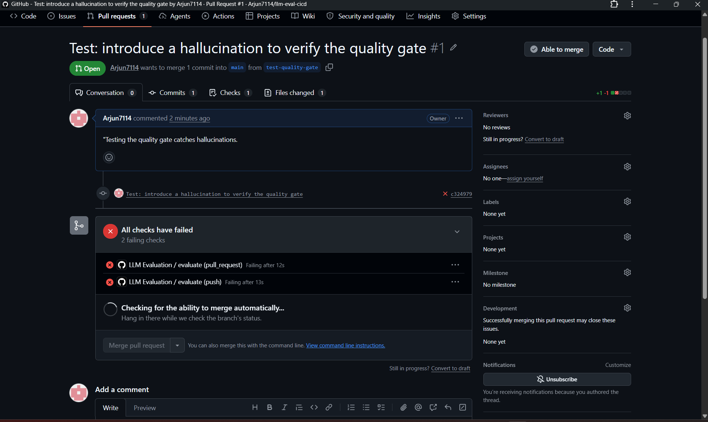

\# LLM Eval CI/CD Pipeline


An automated evaluation pipeline that tests an LLM system on every change — like

unit tests for AI. It runs a golden dataset through the system, measures

hallucination rate, latency, and accuracy, and \*\*blocks the change\*\* if quality

drops below a defined threshold. Runs automatically in GitHub Actions on every push

and pull request.


\## The Problem


When you change a prompt, swap a model, or edit a knowledge base, you have no

automatic way to know if you made the system \*worse\*. Quality regressions —

especially new hallucinations — slip through silently because there's no test

gating them. Code has unit tests and CI; LLM systems usually have neither.


This pipeline brings CI discipline to LLM quality. Every change is automatically

evaluated against a fixed benchmark, and changes that increase hallucination or

blow the latency budget are automatically flagged and blocked — no human has to

remember to check.


\## How It Works


```

git push / pull request

&#x20;       │

&#x20;       ▼

┌──────────────────────┐

│   GitHub Actions      │  fresh Linux runner in the cloud

│   (.github/workflows) │

└──────────────────────┘

&#x20;       │

&#x20;       ▼

┌──────────────────────┐

│   evaluate.py         │  run golden dataset -> metrics -> results.json

└──────────────────────┘

&#x20;       │

&#x20;       ▼

┌──────────────────────┐

│   quality\_gate.py     │  compare metrics to thresholds

└──────────────────────┘

&#x20;       │

&#x20;  ┌────┴─────┐

&#x20;  ▼          ▼

&#x20;exit 0     exit 1

&#x20;(pass →    (fail →

&#x20; green)     red X, change blocked)

```


\## Key Features


\- \*\*Golden dataset\*\* — a fixed benchmark of answerable and unanswerable questions,

&#x20; with expected keywords for grading. The unanswerable ones are what measure

&#x20; hallucination.

\- \*\*Metrics\*\* — accuracy, hallucination rate, and latency, computed on every run

&#x20; and saved to `results.json`.

\- \*\*Quality gate\*\* — configurable thresholds (min accuracy, max hallucination rate,

&#x20; max latency). Fails the build via a non-zero exit code when breached.

\- \*\*GitHub Actions integration\*\* — runs automatically on every push and pull

&#x20; request; a failed gate shows a red X on the commit/PR, the merge-blocking signal.

\- \*\*Mock mode\*\* — the system-under-test can run without a live LLM, so the pipeline

&#x20; works in CI where no GPU or Ollama exists. Switches to a real local model

&#x20; (Llama 3 via Ollama) with an environment variable.


\## Why Mock Mode Matters


CI runners have no GPU and no local models. An eval that could \*only\* call a live

LLM could never run in a pipeline. The system-under-test therefore defaults to a

\*\*mock mode\*\* that returns canned responses, controlled by the `EVAL\_MODE`

environment variable. This mirrors how real teams separate evaluation logic from

the model backend — the eval doesn't care what's behind the interface, so it runs

identically in the cloud and on a developer's machine.


\## Proof It Works


The gate was validated by deliberately introducing a hallucination on a branch and

opening a pull request. GitHub Actions caught it automatically:


\- Hallucination rate jumped from 0% to 25%.

\- The quality gate failed (`exit 1`).

\- The pull request showed a red "All checks have failed" — the change was blocked.


**The pipeline passing on a normal push (green):**



**The pipeline blocking a change that introduced a hallucination (red):**




\## Metrics \& Thresholds


| Metric | Threshold | Typical result |

|---|---|---|

| Accuracy | ≥ 90% | 100% |

| Hallucination rate | ≤ 5% | 0% |

| Avg. latency | < 2000 ms | \~0 ms (mock) |


\## Tech Stack


\- \*\*CI/CD:\*\* GitHub Actions

\- \*\*Language:\*\* Python

\- \*\*LLM (real mode):\*\* Llama 3 via Ollama (local)

\- \*\*Reporting:\*\* tabulate


\## Project Structure


```

llm-eval-cicd/

├── .github/workflows/

│   └── eval.yml            # the CI workflow (runs eval + gate on every push)

├── data/

│   └── golden\_dataset.json # the benchmark questions + answer key

├── system\_under\_test.py    # the LLM system, with mock and real modes

├── evaluate.py             # runs the dataset, computes metrics

├── quality\_gate.py         # pass/fail against thresholds (exit code)

├── requirements.txt

└── README.md

```


\## Running It Locally


```bash

git clone https://github.com/Arjun7114/llm-eval-cicd.git

cd llm-eval-cicd

python -m venv venv

venv\\Scripts\\activate

pip install -r requirements.txt


\# Run in mock mode (default)

python evaluate.py

python quality\_gate.py


\# Run against a real local model

set EVAL\_MODE=real        # Windows

ollama pull llama3

python evaluate.py

```


\## Design Notes \& Limitations


\- \*\*Grading is keyword-based\*\* — an answer is "correct" if it avoids refusing and

&#x20; contains an expected keyword. This is a pragmatic heuristic; a production system

&#x20; would add semantic scoring or an LLM-as-judge for nuance.

\- \*\*Refusal detection uses keyword matching\*\* — robust for clear cases, but a

&#x20; model-based judge would generalise better.

\- \*\*The golden dataset is small (10 questions)\*\* for demonstration; the design

&#x20; scales to hundreds without changes.


\## Related Projects


Part of a series on building trustworthy LLM systems:

\- \*\*\[Self-Healing RAG](https://github.com/Arjun7114/Self-healing-rag)\*\* — a RAG

&#x20; system that critiques and retries its own answers. This pipeline is the kind of

&#x20; gate that would test it on every change.

\- \*\*\[LLM Guardrails Gateway](https://github.com/Arjun7114/llm-guardrails-gateway)\*\* —

&#x20; a security middleware layer that screens LLM input and output.

